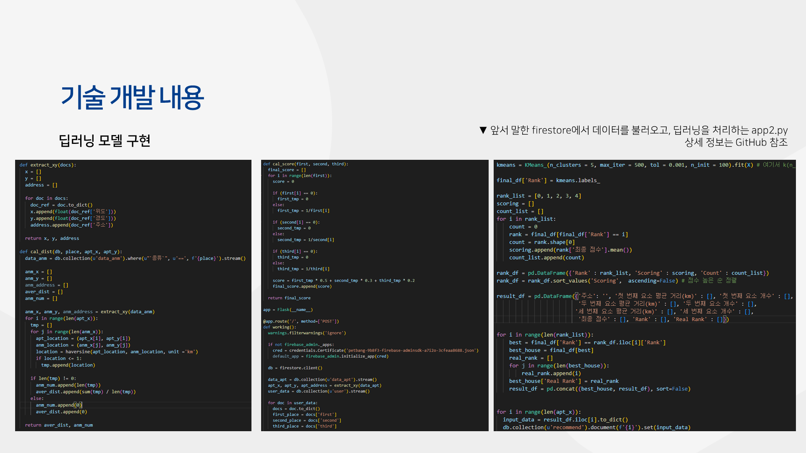

<h3> 1. preprocess.ipynb </h3>
  
크롤링으로 수집된 csv 데이터에 위, 경도를 추가하고 DB에 import 가능한 json 형태로 바꾸는 데이터 전처리 코드

<h3> 2. app1. py </h3>

firestore에서 user 콜렉션의 select 변수에 저장된 정보를 불러온다.
이후 data_apt 콜렉션을 호출해, 각 문서의 주소 변수에 저장된 정보가 위의 select 변수에 저장된 정보와 일치하는지 확인한다.
만약 일치한다면, 해당 문서에 있는 매물 세부 정보 데이터를 반환한다.

<h3> 3. app2. py </h3>
  
firestore에서 data_apt와 data_anm 콜렉션을 호출한다.
이후 user 콜렉션에서 first, second, third 변수를 호출해 매물과 반려동물 시설 간의 1km 내의 개수와 해당 시설들의 평균 거리를 계산한다.
평균 거리를 이용해 점수를 매기고, 데이터 프레임을 생성한다.
이후 최종점수를 이용해 K-Means를 진행하고 생성된 군집을 통해 매물을 분류한다.
분류된 매물 중 사용자가 원하는 매물과 가장 가까운 매물부터 번호를 붙인 후, recommend 콜렉션에 저장한다.

<h3> 4. kmeans_score.ipynb </h3>

K-means를 진행하기 위해 Elbow method와 Silhouette Score을 진행한 코드

<h3> 5. house_crawling.py </h3>
매물을 크롤링하여 수집하는 코드

<h3> 6. petband 폴더 </h3>
Android Studio에서 dart를 이용해 어플리케이션을 구현한 코드
